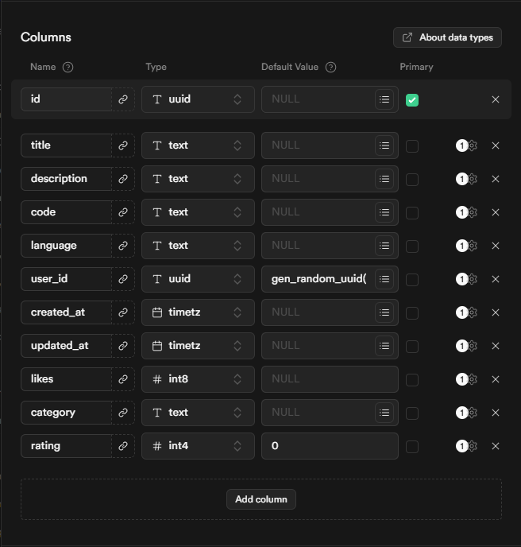

# Code Snippets Hub


## Table of Contents
- [Introduction](#introduction)
- [Features](#features)
- [Installation](#installation)
- [Usage](#usage)
- [Contributing](#contributing)
- [License](#license)

## Introduction

Welcome to **Code Snippets Hub**! 🎉 This project is an open-source platform for discovering and sharing code snippets across multiple programming languages.

## Features

- Pixelated themed UI for a unique developer experience.
- Supports multiple programming languages.
- Easy to share and discover code snippets.

## Installation

1. Clone the repository:
   ```bash
   git clone https://github.com/Vertixx01/CodeSnippetsHub.git
   ```
2. Navigate to the project directory:
   ```bash
   cd CodeSnippetsHub
   ```
3. Install dependencies:
   ```bash
   bun install
   ```

## Usage

Run the development server:
```bash
bun dev
```

## Tech Stack

- **Frontend**: React, TypeScript, Vite
- **Backend**: Supabase
- **Styling**: Tailwind CSS



Access the application at `http://localhost:5565`.

## Contributing

Contributions are welcome! Feel free to open issues or submit pull requests.

## License

This project is licensed under the MIT License.

---

*Note: Ensure your environment variables for Supabase are correctly set in the `.env` file.*